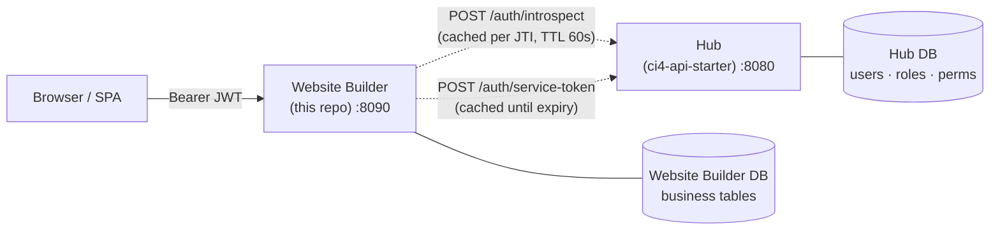
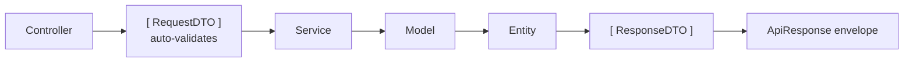

# ci4-website-builder

[](https://codeigniter.com/)
[](https://www.php.net/)
[](phpstan.neon)
[](LICENSE)

> **Status:** v1.0.0 — Spanish version: [README.es.md](README.es.md)

CodeIgniter 4 template for the **website builder** app: a service that owns its own content and delivery logic, but **delegates authentication, users, and IAM to a central hub** (`ci4-api-starter`). One hub can stand in front of many apps without re-implementing auth in each.



Solid arrows = traffic on every request. Dashed = upstream calls to the hub, both cached.

The split:

- The **hub** issues JWTs, owns the `users` / `roles` / `permissions` tables, and resolves effective permissions per `(user, application)`.
- The **website builder app** validates incoming JWTs by calling `POST /api/v1/auth/introspect` on the hub, then enforces permissions locally with the `permission:<code>` filter.
- The website builder app **never** stores users, never issues JWTs, never reads the hub's database directly.

---

## Quick start

```bash
./init.sh
# Prompts for: hub URL, X-App-Key, app code, DB credentials, optional superadmin JWT.
# Runs: composer install → migrate → db:seed SiteBootstrapSeeder → domain:sync-permissions.

php spark serve --port 8090
```

Default port is **8090** to avoid colliding with the hub on `:8080` and the admin on `:8082`.

### Hub coordinates required

Before `init.sh` can finish, the hub must already have:

1. An `applications` row with `code = <hub.appCode>` you'll set here.
2. An API key bound to that application (`php spark apps:bootstrap <code>` on the hub side).
3. *(For the first permission sync only)* a superadmin JWT — service tokens cannot satisfy `iam.superadmin-access`. Get one via `POST /api/v1/auth/login` on the hub with superadmin credentials.

If any of these are missing, `domain:sync-permissions` will fail with a clear message; it is idempotent and safe to re-run.

---

## What's in the box

| Component | Purpose |
|---|---|
| `App\Filters\DomainAuthFilter` (alias `domainauth`) | Replaces local JWT validation. Calls `HubClient::introspect()` and injects `(uid, permissions[])` into the request context. |
| `App\Libraries\Hub\HubClient` | Single point of contact with the hub. Handles introspection caching (per JTI) and service-token caching with safety-margin refresh. |
| `App\Commands\SyncPermissions` (`php spark domain:sync-permissions`) | Registers the permissions in `Config\DomainPermissions` with the hub via `POST /api/v1/iam/permissions`. Idempotent. |
| `App\Config\DomainPermissions` | Declarative source of truth for the permissions this app owns. |
| `App\Config\Scaffolding` override | `make-crud` generates routes already wrapped in `domainauth + permission:<code> + throttle`. |
| `App\Models\BaseAuditableModel` + `Auditable` trait | Local audit logs persisted in this app's `audit_logs` table. |
| Inherited hardening | Security headers, correlation IDs, idempotency keys, deprecation headers, RFC 7807 problem details, maintenance mode filter, JSON file logging, request logs / metrics / queue infra. |

## What's NOT in the box

This is the website builder app, not the hub. The following are **out of scope** here and live in the hub instead:

- `users` / `roles` / `permissions` tables and admin endpoints (`/api/v1/iam/*`)
- Login, logout, password reset, email verification, Google OAuth
- JWT issuance and refresh
- File storage drivers (S3, local) — re-add as a domain-specific module if a particular domain needs it

---

## Common commands

```bash
# Dev server
php spark serve --port 8090

# Database
php spark migrate                    # Local migrations only — never touches the hub DB
php spark db:seed SiteBootstrapSeeder # OPTIONAL: Spanish-first demo content (languages, settings, pages, menus, blocks). Safe to skip or re-run at any time — see "Required vs. optional bootstrap" below.
php spark tests:prepare-db           # Sync the test DB before feature tests

# Hub permission sync (idempotent — safe to rerun)
php spark domain:sync-permissions --admin-token=<jwt>     # or set hub.adminToken in .env

This command traverses the full manifest, so `created`, `existing`, and `rejected` can all appear in the result. In this stack, `self-permissions` only accepts permissions that match the app namespace, so a `rejected: 21` count is expected when the manifest also includes shared, non-namespaced permissions that are handled separately during role attachment.

# Tests
vendor/bin/phpunit                   # All
vendor/bin/phpunit tests/Unit        # Fast, no DB
vendor/bin/phpunit tests/Integration # DB-level
vendor/bin/phpunit tests/Feature     # HTTP endpoints (requires tests:prepare-db)

# Quality gates
composer quality                     # PHPStan level 8 + PHPUnit + cs-check
composer cs-fix                      # Auto-fix style — run before committing

# OpenAPI
php spark swagger:generate
```

### Required vs. optional bootstrap

**Only two things are actually required for this app to function:**

1. `php spark migrate` — creates the schema. Without this, nothing works.
2. `php spark domain:sync-permissions` (with the hub's `RbacBootstrapSeeder` already run on the hub side) —
   registers this app's permission codes so RBAC gating on domain routes works.

**Everything under `db:seed SiteBootstrapSeeder` is optional demo content**, not structural setup:
languages, site identity/contact settings, block type examples, the "noticias"/"cartelera"/"portafolio"
demo collections, and the demo pages (home, about, history, portfolio) and menus it builds from them. A
fresh install with *only* migrations run (no seeders) is a fully working, empty CMS: the admin panel lets
you create your first language, block type, page, and collection from scratch through its own CRUD screens
— none of that requires seed data to exist first. Losing or resetting this content (e.g. by re-running
`php spark migrate:refresh` against a database you didn't mean to touch) does not break the application; it
just leaves you with an empty CMS. Re-run `php spark db:seed SiteBootstrapSeeder` at any time to restore the
demo content, or build your own content from the empty state.

### Adding a new CRUD module

Use the shell wrapper (non-TTY-safe — `php spark make:crud` directly hangs in CI / Claude Code):

```bash
bash vendor/bin/make-crud.sh Item Example 'name:string:required|searchable,description:text' yes
php spark migrate
pkill -f 'spark serve'; php spark serve --port 8090 &     # routes are not hot-reloaded
php spark swagger:generate
```

The generator emits routes already wrapped in `domainauth + permission:items.read + throttle`. Adjust the per-verb permission codes if read and write should diverge.

When the module grows beyond flat CRUD, use the documented aggregate-extension pattern instead of forcing everything into the generated shape: [`docs/architecture/EXTENSION_GUIDE.md`](docs/architecture/EXTENSION_GUIDE.md).

### Adding a new permission

1. Append it to `app/Config/DomainPermissions.php::PERMISSIONS`.
2. Run `php spark domain:sync-permissions` — registers it with the hub (idempotent).
3. In the hub admin panel, attach the new permission to the role(s) that should carry it.
4. Reference the code in your route filter: `permission:items.archive`.

> **Permission separator is `.`, never `:`** — CI4's filter parser splits on `:` for arguments and silently truncates `permission:items:archive` to `permission:items`. See `TASKS.md` ⇒ "Architecture contracts".

---

## Configuration

Required environment variables (see `.env.example`):

| Variable | Purpose |
|---|---|
| `hub.url` | Base URL of the hub (e.g. `http://localhost:8080`) |
| `hub.apiKey` | `X-App-Key` bound to this app's `applications` row in the hub |
| `hub.appCode` | Application code as registered in the hub |
| `hub.introspectCacheTtl` | *(optional)* Introspect-response cache TTL in seconds, default `60` |
| `hub.adminToken` | *(optional)* Superadmin JWT for `domain:sync-permissions` — prefer the `--admin-token` flag for one-shot use |
| `database.default.*` | This app's own MySQL connection |
| `encryption.key` | CI4 encryption key (32 bytes after `hex2bin:` decode) |

> **Tokens are server-side only.** Pass them via `Authorization: Bearer …` headers (SPA) or PHP sessions (server-rendered admin). Never store JWTs in `localStorage` or non-HttpOnly cookies.

### Docker configuration

`docker compose config --quiet` works on a clean checkout using non-production
development defaults. To override them, copy `.env.docker.example` to the
gitignored `.env.docker`, replace every placeholder, and start the stack with
`docker compose --env-file .env.docker up`. The standalone Domain stack uses ports `8086` (application), `3308`
(MySQL), and `8087` (phpMyAdmin profile) by default; override them with
`DOMAIN_HOST_PORT`, `DOMAIN_DB_HOST_PORT`, and
`DOMAIN_PHPMYADMIN_HOST_PORT`.

---

## Architecture

DTO-first layered pipeline, identical in shape to the hub:



Each step has one job: `RequestDTO` validates inputs at construction, `Service` runs pure business logic (DTO in, DTO out, transactional via `HandlesTransactions`), `Model` does persistence, `Entity` is the row, `ResponseDTO` is the contract emitted to clients. `ApiController::handleRequest()` orchestrates the wiring with no boilerplate.

The base classes (`ApiController`, `BaseCrudService`, `BaseRequestDTO`, `BaseAuditableModel`, the audit chain, the `HandlesTransactions` trait, the `ApiException` family) live in the [`dcardenasl/ci4-api-core`](https://packagist.org/packages/dcardenasl/ci4-api-core) package and are imported from the `dcardenasl\Ci4ApiCore\…` namespace. The domain template only contains domain-specific code; runtime upgrades happen by bumping the package constraint in `composer.json`.

For the full architecture and contracts:

- [`docs/architecture/OVERVIEW.md`](docs/architecture/OVERVIEW.md) — layers, request flow, conventions
- [`docs/architecture/AUTHENTICATION.md`](docs/architecture/AUTHENTICATION.md) — hub delegation in detail
- [`docs/template/ARCHITECTURE_CONTRACT.md`](docs/template/ARCHITECTURE_CONTRACT.md) — what generated code must look like (SSOT)
- [`CLAUDE.md`](CLAUDE.md) — working agreements for coding agents (also useful for humans)
- [`TASKS.md`](TASKS.md) — current work and open backlog

The full documentation index is at [`docs/README.md`](docs/README.md).

---

## Versioning & releases

This template follows [Semantic Versioning](https://semver.org/). See [`CHANGELOG.md`](CHANGELOG.md) for what changed between versions.

---

## License

[MIT](LICENSE).
